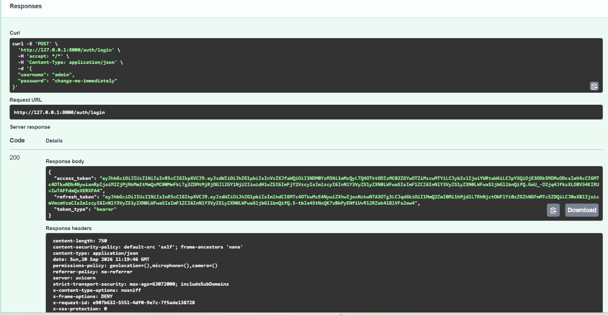
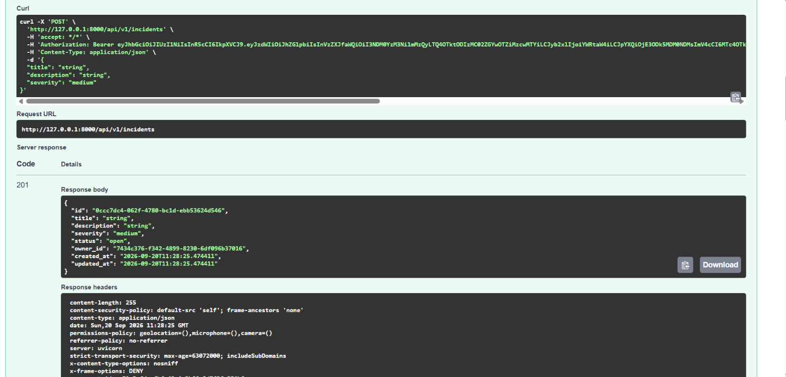
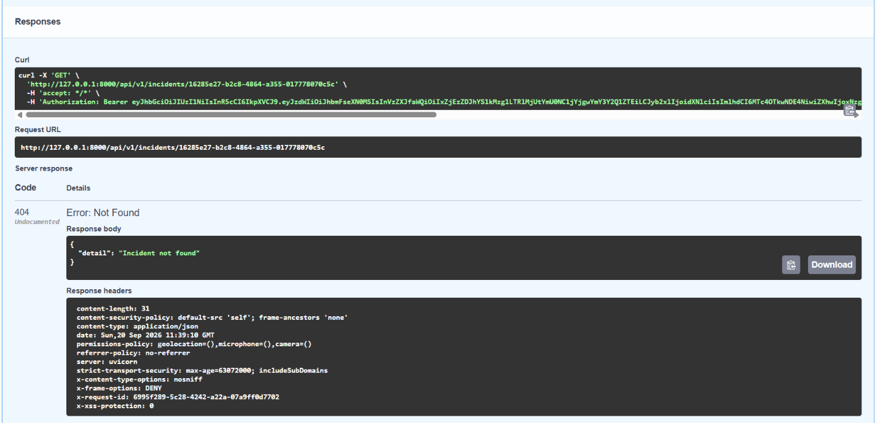
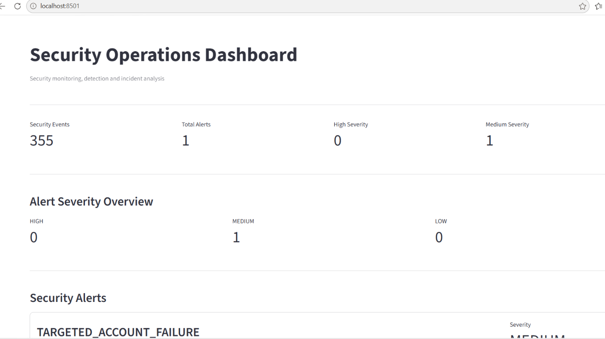
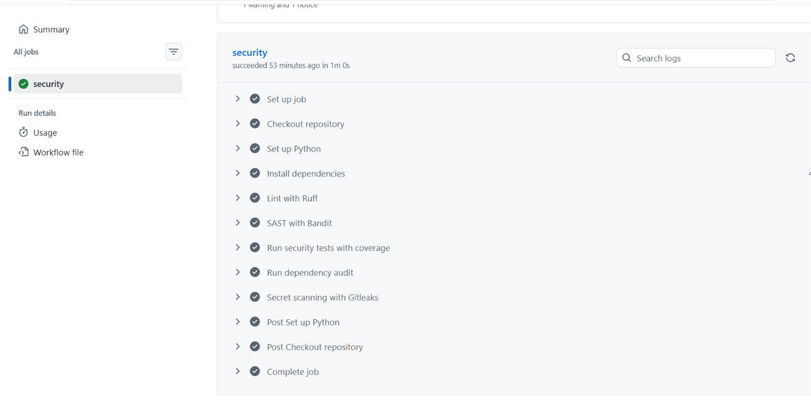

# Secure REST API DevSecOps

A security-focused REST API built with **FastAPI**, designed around practical application security, authentication, authorization, auditability, security monitoring, and DevSecOps automation.

The project demonstrates how a modern security-aware API can integrate preventive controls, detection capabilities, security logging, incident management, automated testing, containerized deployment, and CI security gates into a single application.

---

## Project Overview

This project implements a secure REST API with:

* JWT-based authentication (access + refresh token architecture)
* Refresh token rotation and server-side revocation
* Role-Based Access Control (RBAC)
* Secure password hashing with Argon2 (`pwdlib`)
* SQLAlchemy database integration with Alembic migrations
* Security audit logging (database-backed)
* Request ID / correlation tracking
* Structured JSON security logging
* Login rate limiting
* HTTP security headers (CSP, HSTS, X-Frame-Options, etc.)
* Incident management with object-level authorization
* SIEM-style security event monitoring
* Automated security alert generation
* Machine-readable security reports
* SOC-style monitoring dashboard (Streamlit)
* Containerized deployment (Docker + Docker Compose)
* Automated security testing
* Static security analysis (Bandit)
* Dependency vulnerability auditing (pip-audit)
* Secret scanning (Gitleaks)
* GitHub Actions security CI pipeline

---

## Security Architecture

```text
                        Client
                          |
                          v
                +---------------------+
                |    FastAPI API      |
                +---------------------+
                          |
             +------------+------------+
             |                         |
             v                         v
      Request ID Middleware     Security Headers
             |                         |
             +------------+------------+
                          |
                          v
                +---------------------+
                | Authentication      |
                | JWT / RBAC           |
                +---------------------+
                          |
             +------------+------------+
             |                         |
             v                         v
       API Resources            Incident Management
             |                         |
             +------------+------------+
                          |
                          v
                +---------------------+
                | Audit Logging        |
                | Structured JSON Logs |
                +---------------------+
                          |
                          v
                +---------------------+
                | Security Monitoring  |
                +---------------------+
                          |
             +------------+------------+
             |                         |
             v                         v
       Alert Engine             Security Report
             |                         |
             +------------+------------+
                          |
                          v
                +---------------------+
                | SOC Dashboard        |
                | Streamlit            |
                +---------------------+
```

---

## Security Controls

### Authentication

The API uses JWT-based authentication with separate, explicitly-typed access and refresh tokens.

Security features include:

* Signed JWT access tokens (`type: access`)
* Signed JWT refresh tokens (`type: refresh`)
* Token expiration (`exp`)
* Token type validation (an access token cannot be used where a refresh token is required, and vice versa)
* JWT ID (`jti`) for refresh-token tracking
* Issuer (`iss`) validation
* Audience (`aud`) validation
* Issued-at (`iat`) claims
* Refresh token rotation (each use issues a new pair and invalidates the old one)
* Refresh token revocation (server-side, database-backed — supports logout)

### Authorization

Role-Based Access Control is implemented for protected resources.

Supported roles include:

* `analyst`
* `admin`

Administrative endpoints require the appropriate role. Incident resources additionally enforce **object-level authorization**: a user can only retrieve or list incidents they own, identified by their database user ID (not their username), which is carried in the JWT `user_id` claim.

### Password Security

Passwords are never stored in plaintext. The project uses:

* `pwdlib` with Argon2 password hashing
* Password verification before authentication
* Secure password storage practices

### Rate Limiting

Authentication endpoints use request rate limiting through SlowAPI.

```text
POST /auth/login
5 requests per minute
```

This reduces automated authentication attacks such as repeated password guessing.

### Security Headers

The application applies security-related HTTP headers through custom middleware:

* `X-Frame-Options`
* `X-Content-Type-Options`
* `Referrer-Policy`
* `Permissions-Policy`
* `Content-Security-Policy` (relaxed for `/docs` and `/redoc` so Swagger UI can load its assets; strict `default-src 'self'` everywhere else)
* `Strict-Transport-Security`

### Request Correlation

Every API request receives a unique request ID, returned as `X-Request-ID`. Clients can also supply their own. The same identifier is correlated across:

```text
API Request
     |
     +--> Structured Security Log
     |
     +--> Audit Record
     |
     +--> Security Monitoring
     |
     +--> SOC Alert
```

This provides an investigation-friendly trail for security events.

---

## Health and Readiness

```text
GET /health      Liveness check — is the process running?
GET /readiness   Readiness check — is the database reachable?
```

`/health` is intentionally **public** (no authentication required) so container orchestrators such as Docker or Kubernetes can probe it without credentials. `/readiness` additionally verifies database connectivity and returns `503` if the database is unreachable.

---

## Incident Management

The API includes security incident management capabilities.

Authenticated users can create and retrieve incidents. Object-level authorization prevents users from accessing incidents belonging to other users — ownership is checked against the requesting user's database ID, not just their role, which protects against insecure direct object reference (IDOR) / broken object-level authorization (BOLA) attacks.

```text
POST /api/v1/incidents
GET  /api/v1/incidents
GET  /api/v1/incidents/{incident_id}
```

Security principles demonstrated:

* Authentication before access
* User ownership validation by database ID
* Object-level authorization
* Controlled incident retrieval
* Security-focused API design

> **Current limitation:** all incident routes filter by the requesting user's own ownership, including for the `admin` role — administrators cannot yet view other users' incidents. Broader admin visibility, and `PATCH`/`DELETE` incident endpoints, are planned next steps (see *Roadmap* below).

---

## SIEM-Style Security Monitoring

The project includes a lightweight security monitoring pipeline that processes structured application security logs.

```text
security.log
     |
     v
Log Parser
     |
     v
Security Events
     |
     v
Alert Engine
     |
     +---- Authentication Failure Burst
     |
     +---- Targeted Account Failure
     |
     v
Security Alerts
     |
     v
JSON Security Report
     |
     v
SOC Dashboard
```

### Detection Rules

**Authentication Failure Burst** — repeated failed authentication attempts from the same IP address.

```text
Default threshold: 5 failed attempts
Alert: AUTHENTICATION_FAILURE_BURST  (Severity: HIGH)
```

**Targeted Account Failure** — repeated authentication failures against the same username.

```text
Default threshold: 3 failed attempts
Alert: TARGETED_ACCOUNT_FAILURE  (Severity: MEDIUM)
```

Alerts include SOC-oriented metadata: alert ID, alert type, detection rule, severity, detection timestamp, source IP, target account, event count, correlated request IDs, and a description.

---

## SOC Security Dashboard

A Streamlit-based SOC monitoring dashboard provides visibility into:

* Total security events and alerts (by severity)
* Security alert details
* Detection rules triggered
* Target accounts and source IPs
* Correlated request IDs
* The latest monitoring report

```text
Application Logs → Security Monitoring → Detection Rules → Security Report → SOC Dashboard
```

Run it with:

```powershell
streamlit run .\src\dashboard\app.py
```

Available locally at `http://localhost:8501`.

---
---

---

## Screenshots

### Interactive API Documentation (Swagger UI)


### Successful Login (Access + Refresh Tokens)



### Creating a Security Incident



### Object-Level Authorization (BOLA/IDOR Protection)

A user attempting to access another user's incident receives a `404`, not the incident's data:



### Automated Security Tests Passing


### SOC Monitoring Dashboard



### CI Security Pipeline (GitHub Actions)



---
## Security Monitoring Report

The monitoring engine generates a machine-readable JSON report at `reports/security_report.json`:

```json
{
  "generated_at": "2026-09-19T11:24:08+00:00",
  "summary": {
    "total_events": 355,
    "total_alerts": 1,
    "alerts_by_severity": {
      "MEDIUM": 1
    }
  },
  "alerts": [
    {
      "alert_id": "ALT-XXXXXXXXXXXX",
      "alert_type": "TARGETED_ACCOUNT_FAILURE",
      "rule": "targeted_account_failure",
      "severity": "MEDIUM",
      "event_count": 3
    }
  ]
}
```

`reports/` and `logs/` are generated at runtime and are excluded from version control (see `.gitignore`) — they are not checked into the repository.

---

## Deployment with Docker

The project includes a Docker setup for local container-based development.

```powershell
docker compose up --build
```

This starts:

* FastAPI on `http://localhost:8000`
* PostgreSQL on the internal Docker network, with a health check gating API startup

The API container runs as a non-root user and includes a built-in container health check against `/health`.

> **Before using this beyond local development:** replace the default `POSTGRES_PASSWORD` and `JWT_SECRET_KEY` values in `docker-compose.yml` with real secrets supplied via environment variables, and disable or scope `Strict-Transport-Security` appropriately if not served over HTTPS.

---

## DevSecOps Pipeline

Security checks are integrated into GitHub Actions (`.github/workflows/security.yml`):

```text
Code
 |
 +--> Ruff (lint)
 |
 +--> Bandit (SAST)
 |
 +--> Pytest
 |
 +--> Coverage (>= 85%)
 |
 +--> pip-audit (dependency scan)
 |
 +--> Gitleaks (secret scanning)
 |
 v
Security CI
```

### CI Security Gates

* Automated unit/integration testing
* Minimum **85% test coverage** enforced
* Ruff code quality checks
* Bandit security analysis
* Dependency vulnerability auditing with pip-audit
* Secret detection with Gitleaks

Current project validation:

```text
Tests:       34 passed
Coverage:    88.74%
CI Status:   Passing
```

The Streamlit dashboard is intentionally excluded from the backend coverage calculation, as it is a UI layer rather than API/security logic.

---

## Testing

The project uses `pytest` for automated testing. The suite covers:

* Public endpoint behavior (`/`, `/health`)
* Authentication (valid, invalid, and missing tokens)
* Access-token and refresh-token validation
* Refresh-token rotation and reuse rejection
* Logout and token revocation
* RBAC (analyst vs. admin access)
* Security headers
* Audit logging
* Incident creation and retrieval
* Incident ownership and cross-user access denial (BOLA/IDOR protection)
* Request ID correlation
* Failed-login and targeted-account detection rules
* Security log parsing
* Security report generation

```powershell
python -m pytest -v
python -m pytest -v --cov=src --cov-report=term-missing --cov-fail-under=85
```

Current result:

```text
34 passed
88.74% coverage
```

---

## Technology Stack

| Technology     | Purpose                           |
| -------------- | ---------------------------------- |
| Python 3.12    | Application language               |
| FastAPI        | REST API framework                 |
| Uvicorn        | ASGI server                        |
| PyJWT          | JWT authentication                 |
| pwdlib         | Password hashing                   |
| Argon2         | Password hashing algorithm         |
| SQLAlchemy     | Database ORM                       |
| Alembic        | Database migrations                |
| SlowAPI        | API rate limiting                  |
| Streamlit      | SOC dashboard                      |
| Docker         | Containerized deployment           |
| Pytest         | Automated testing                  |
| Ruff           | Code quality / linting             |
| Bandit         | Python security analysis (SAST)    |
| pip-audit      | Dependency vulnerability scanning  |
| Gitleaks       | Secret detection                   |
| GitHub Actions | CI/CD security automation          |

---

## Project Structure

```text
Secure-REST-API-DevSecOps/
│
├── .github/
│   └── workflows/
│       └── security.yml
│
├── src/
│   ├── dashboard/
│   │   ├── __init__.py
│   │   └── app.py
│   │
│   ├── security/
│   │   ├── __init__.py
│   │   ├── audit.py
│   │   ├── auth.py
│   │   ├── incidents.py
│   │   ├── jwt_config.py
│   │   ├── middleware.py
│   │   ├── request_id.py
│   │   ├── schemas.py
│   │   └── users.py
│   │
│   ├── security_monitoring/
│   │   ├── __init__.py
│   │   ├── alert_engine.py
│   │   ├── log_parser.py
│   │   ├── monitor.py
│   │   └── report_generator.py
│   │
│   ├── database.py
│   ├── dependencies.py
│   ├── logging_config.py
│   ├── main.py
│   └── models.py
│
├── tests/
│   ├── conftest.py
│   ├── test_security.py
│   └── test_security_monitoring.py
│
├── migrations/
│   └── versions/
│
├── scripts/
│   └── seed_admin.py
│
├── Dockerfile
├── docker-compose.yml
├── .dockerignore
│
├── .coveragerc
├── .gitignore
├── pyproject.toml
├── pytest.ini
├── requirements.txt
├── requirements-dev.txt
└── README.md
```

> `reports/` and `logs/` are created automatically at runtime and are not part of the committed repository structure.

---

## Installation

```powershell
git clone https://github.com/Shumii98/Secure-REST-API-DevSecOps.git
cd Secure-REST-API-DevSecOps

python -m venv .venv
Set-ExecutionPolicy -Scope Process -ExecutionPolicy Bypass
.\.venv\Scripts\Activate.ps1

python -m pip install -r requirements.txt
python -m pip install -r requirements-dev.txt
```

Create a local `.env` file with the required configuration (see `.env.example` if present), and never commit it — it's excluded via `.gitignore`.

---

## Running the API

```powershell
uvicorn src.main:app --reload
```

* API: `http://127.0.0.1:8000`
* Interactive docs (Swagger UI): `http://127.0.0.1:8000/docs`

---

## Running Security Monitoring

```powershell
python -m src.security_monitoring.monitor
```

```text
Security log → Log parser → Alert engine → Security report
```

Output: `reports/security_report.json`

---

## Running the SOC Dashboard

After generating the monitoring report:

```powershell
streamlit run .\src\dashboard\app.py
```

Open `http://localhost:8501`.

---

## Example Security Investigation

A failed authentication event can be traced end-to-end through the monitoring pipeline:

```text
1. Authentication failure
          |
          v
2. Structured JSON security log written
          |
          v
3. Request ID assigned and correlated
          |
          v
4. Audit record created in the database
          |
          v
5. Monitoring engine analyzes the event
          |
          v
6. Detection threshold reached
          |
          v
7. SOC alert generated
          |
          v
8. Alert displayed in the dashboard
```

This demonstrates the relationship between **prevention, logging, detection, and investigation** in an application security context.

---

## Roadmap

Known gaps, tracked honestly for transparency:

* [ ] Admin visibility into all incidents (currently every role, including admin, only sees its own)
* [ ] `PATCH` / `DELETE` incident endpoints with authorization tests
* [ ] Move Docker Compose secrets (`POSTGRES_PASSWORD`, `JWT_SECRET_KEY`) to environment variables with a `.env.example`
* [ ] Make `Strict-Transport-Security` conditional on HTTPS deployment
* [ ] Validate/sanitize client-supplied `X-Request-ID` values (length, character set)
* [ ] Add Trivy container image scanning and SBOM generation to CI
* [ ] Add a PostgreSQL integration-test job in CI (currently SQLite-only in tests)

---

## Security Engineering Concepts Demonstrated

* Secure API development
* Authentication and authorization (RBAC + object-level)
* JWT security and token lifecycle management
* Password security
* Rate limiting
* Security headers
* Audit logging and structured logging
* Correlation IDs
* Incident management
* Security monitoring and detection engineering
* Alert generation and SOC workflows
* Containerized deployment
* DevSecOps and CI security gates
* Dependency and secret vulnerability scanning
* Automated security testing

---

## Portfolio Relevance

This project was designed to demonstrate security engineering and SOC-oriented capabilities beyond a basic CRUD API:

```text
Secure Development + Application Security + Detection Engineering
+ Security Monitoring + Incident Management + DevSecOps Automation
```

The result is a practical, security-focused application demonstrating both **preventive security controls** and **security operations capabilities** — while transparently tracking what's still in progress.

---

## Author

**Shumaila**
M.S. Information Security
Cybersecurity | SOC | Application Security | DevSecOps

GitHub: [https://github.com/Shumii98](https://github.com/Shumii98)