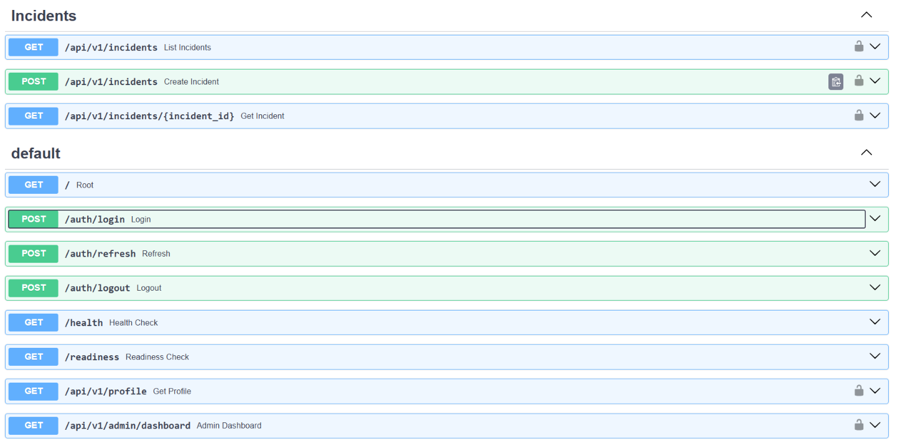
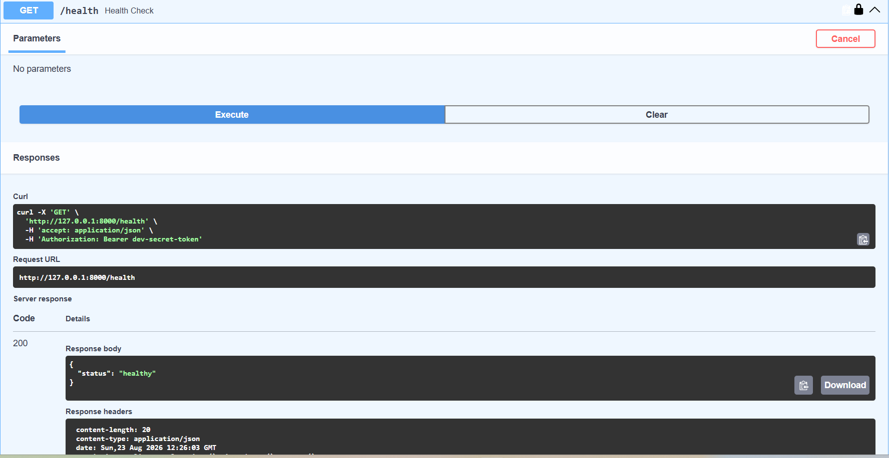
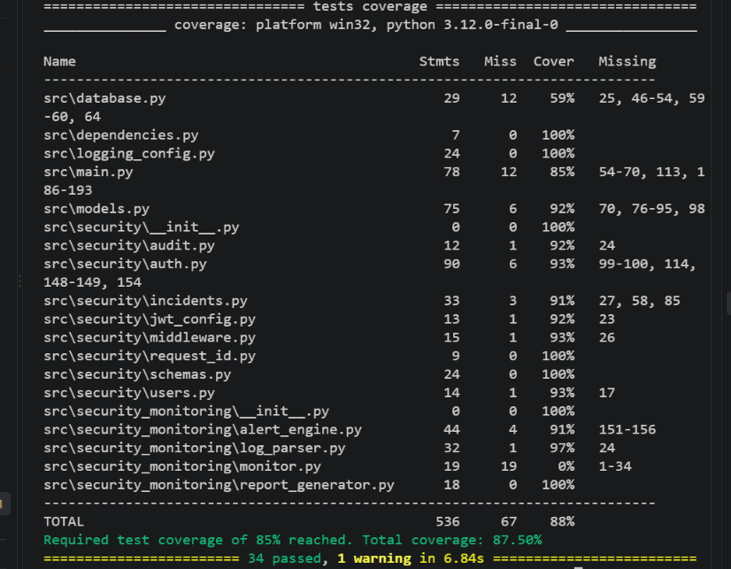

# Secure REST API – DevSecOps

A security-focused REST API built with **FastAPI** and designed around practical **DevSecOps principles**.

This project demonstrates JWT-based authentication, role-based access control (RBAC), protected API endpoints, HTTP security headers, automated security testing, dependency vulnerability auditing, environment-based configuration, and continuous security checks through GitHub Actions.

---

## Overview

The project demonstrates how security controls can be integrated into the API development lifecycle rather than being added only after application development.

### Security Capabilities

* 🔐 JWT Bearer-token authentication
* 🔒 Protected API endpoints
* 🛡️ HTTP security headers through custom middleware
* ⏱️ JWT expiration handling
* 👤 Role-Based Access Control (RBAC)
* 🌐 Versioned API endpoints
* 🧪 Automated security testing with `pytest`
* 🔍 Dependency vulnerability scanning with `pip-audit`
* ⚙️ GitHub Actions security CI
* 🔑 Environment-based secret configuration
* 🔒 Password hashing with `pwdlib`
* 📦 Separate application and development dependencies

The goal is to demonstrate a practical **Secure SDLC / DevSecOps workflow** for a Python REST API.

---

## Security Architecture

```text
                         ┌──────────────────────┐
                         │      API Client      │
                         └──────────┬───────────┘
                                    │
                              HTTP Request
                                    │
                                    ▼
                         ┌──────────────────────┐
                         │     FastAPI API      │
                         └──────────┬───────────┘
                                    │
                   ┌────────────────┴────────────────┐
                   │                                 │
                   ▼                                 ▼
          ┌──────────────────┐             ┌──────────────────┐
          │ JWT Authentication│             │ Security Headers │
          │ Bearer Token      │             │ Middleware       │
          └────────┬─────────┘             └────────┬─────────┘
                   │                                 │
                   └───────────────┬─────────────────┘
                                   │
                                   ▼
                         ┌──────────────────────┐
                         │ Authorization / RBAC │
                         │ Role Verification    │
                         └──────────┬───────────┘
                                    │
                     ┌──────────────┴──────────────┐
                     │                             │
                     ▼                             ▼
             ┌───────────────┐             ┌─────────────────┐
             │ Analyst User  │             │   Admin User    │
             │ Standard      │             │ Elevated Access │
             └───────┬───────┘             └────────┬────────┘
                     │                              │
                     ▼                              ▼
             ┌───────────────┐             ┌─────────────────┐
             │ Profile API   │             │ Admin Dashboard │
             └───────┬───────┘             └────────┬────────┘
                     │                              │
                     └──────────────┬───────────────┘
                                    ▼
                         ┌──────────────────────┐
                         │    JSON Response     │
                         └──────────────────────┘
```

### DevSecOps CI Pipeline

```text
                  Git Push / Pull Request
                             │
                             ▼
                  ┌─────────────────────┐
                  │   GitHub Actions    │
                  │    Security CI      │
                  └──────────┬──────────┘
                             │
                   ┌─────────┴─────────┐
                   │                   │
                   ▼                   ▼
              ┌──────────┐       ┌─────────────┐
              │  pytest  │       │  pip-audit  │
              │ 12 tests │       │ Dependency  │
              └────┬─────┘       │    Scan     │
                   │              └──────┬──────┘
                   │                     │
                   └──────────┬──────────┘
                              ▼
                       ┌─────────────┐
                       │  CI Result  │
                       │    PASS     │
                       └─────────────┘
```

---

## Security Controls

### 1. JWT Authentication

The API uses **JSON Web Tokens (JWT)** with the configured signing algorithm.

The authentication flow is:

```text
Username + Password
        │
        ▼
POST /auth/login
        │
        ▼
Credentials validated
        │
        ▼
JWT access token generated
        │
        ▼
Authorization: Bearer <token>
        │
        ▼
Protected endpoint
```

JWT tokens contain:

* `sub` — authenticated username
* `role` — user's authorization role
* `exp` — token expiration timestamp

Protected endpoints reject requests without valid authentication.

Invalid or expired tokens return:

```text
401 Unauthorized
```

---

### 2. Role-Based Access Control (RBAC)

The API implements role-based authorization using the user's role stored inside the JWT.

The project contains two demonstration roles:

| Role      | Access                            |
| --------- | --------------------------------- |
| `analyst` | Authenticated user/profile access |
| `admin`   | Admin-level access                |

The administrator endpoint is:

```text
GET /api/v1/admin/dashboard
```

Access behavior:

```text
Valid analyst JWT
        │
        ▼
Admin Dashboard
        │
        ▼
403 Forbidden
```

```text
Valid admin JWT
        │
        ▼
Admin Dashboard
        │
        ▼
200 OK
```

This demonstrates the difference between authentication and authorization:

* **401 Unauthorized** — authentication failed or token is missing/invalid.
* **403 Forbidden** — the user is authenticated but does not have the required role.

---

### 3. Password Security

User passwords are not stored as plaintext.

The project uses `pwdlib` for password hashing and verification.

The demonstration users are defined in the application's user configuration for educational purposes.

In a production system, user credentials should be stored in a properly secured database and managed through a production-grade identity/authentication system.

---

### 4. Protected Endpoints

The following endpoints require authentication:

```text
GET /health

GET /api/v1/profile

GET /api/v1/admin/dashboard
```

The admin dashboard additionally requires the `admin` role.

---

### 5. Security Headers

Security-related HTTP response headers are applied through custom middleware.

Current headers include:

```text
X-Content-Type-Options: nosniff

X-Frame-Options: DENY

Referrer-Policy: no-referrer

Permissions-Policy: geolocation=(),microphone=(),camera=()
```

These controls help reduce common browser-side security risks such as MIME sniffing, clickjacking, unnecessary referrer exposure, and unwanted browser feature access.

---

### 6. API Versioning

The profile and administrative functionality are exposed under a versioned API path:

```text
/api/v1/
```

Examples:

```text
GET /api/v1/profile

GET /api/v1/admin/dashboard
```

API versioning provides a foundation for maintaining compatibility as the application evolves.

---

## API Endpoints

| Method | Endpoint                  | Authentication | Purpose                         |
| ------ | ------------------------- | -------------- | ------------------------------- |
| `GET`  | `/`                       | Public         | API status                      |
| `POST` | `/auth/login`             | Public         | Authenticate user and issue JWT |
| `GET`  | `/health`                 | Required       | Protected health check          |
| `GET`  | `/api/v1/profile`         | Required       | Retrieve authenticated profile  |
| `GET`  | `/api/v1/admin/dashboard` | Admin role     | Administrator dashboard         |

---

## Authentication Flow

### Login

```http
POST /auth/login
Content-Type: application/json
```

Example request:

```json
{
  "username": "security-user",
  "password": "DevSecOps@123"
}
```

Successful response:

```json
{
  "access_token": "<JWT_TOKEN>",
  "token_type": "bearer"
}
```

The returned JWT is then supplied to protected endpoints using:

```http
Authorization: Bearer <JWT_TOKEN>
```

> The demonstration credentials are intended only for local and educational testing. Never use them in production.

---

## Example API Requests

### Root Endpoint

```http
GET /
```

Example response:

```json
{
  "message": "Secure REST API is running",
  "status": "ok"
}
```

---

### Health Check

```http
GET /health
Authorization: Bearer <JWT_TOKEN>
```

Example response:

```json
{
  "status": "healthy"
}
```

Requests without valid authentication are rejected.

---

### Profile

```http
GET /api/v1/profile
Authorization: Bearer <JWT_TOKEN>
```

Example authenticated response:

```json
{
  "username": "security-user",
  "role": "analyst",
  "message": "Authenticated access granted"
}
```

Invalid or expired tokens are rejected with:

```json
{
  "detail": "Invalid or expired authentication token"
}
```

---

### Admin Dashboard

```http
GET /api/v1/admin/dashboard
Authorization: Bearer <ADMIN_JWT_TOKEN>
```

Example successful response:

```json
{
  "message": "Welcome to the admin dashboard",
  "username": "admin-user"
}
```

An authenticated analyst attempting to access the administrator endpoint receives:

```json
{
  "detail": "You do not have permission to access this resource"
}
```

with HTTP status:

```text
403 Forbidden
```

---

## Project Structure

```text
Secure-REST-API-DevSecOps/
│
├── .github/
│   └── workflows/
│       └── security.yml
│
├── src/
│   ├── main.py
│   │
│   └── security/
│       ├── __init__.py
│       ├── auth.py
│       ├── jwt_config.py
│       ├── middleware.py
│       ├── schemas.py
│       └── users.py
│
├── tests/
│   └── test_security.py
│
├── screenshots/
│   ├── swagger-api.png
│   ├── authenticated-health.png
│   └── security-tests-passed.png
│
├── .gitignore
├── README.md
├── requirements.txt
└── requirements-dev.txt
```

---

## DevSecOps Pipeline

The project uses **GitHub Actions** to automatically execute security checks on pushes and pull requests targeting the `main` branch.

### Pipeline Workflow

```text
Git Push / Pull Request
          │
          ▼
   Checkout Repository
          │
          ▼
      Setup Python
          │
          ▼
   Install Dependencies
          │
          ├─────────────────┐
          ▼                 ▼
       pytest           pip-audit
          │                 │
          ▼                 ▼
   Security Tests     Dependency Scan
          │                 │
          └────────┬────────┘
                   ▼
              CI Result
```

### Automated Checks

The CI pipeline performs:

1. Python environment setup
2. Dependency installation
3. Full pytest test-suite execution
4. Dependency vulnerability auditing

The workflow is defined in:

```text
.github/workflows/security.yml
```

---

## Testing

Security tests are implemented using **pytest** and FastAPI's `TestClient`.

The test suite validates:

* Authentication required for `/health`
* Invalid token rejection
* Valid token acceptance
* Security header validation
* Authentication required for `/api/v1/profile`
* Valid profile authentication
* Invalid profile authentication
* Public root endpoint
* Security headers on protected endpoints
* Analyst cannot access admin dashboard
* Admin can access admin dashboard
* Profile returns the correct user role

Run the complete test suite:

```powershell
python -m pytest -v
```

Current test result:

```text
12 passed
```

### Security Test Coverage

```text
Valid JWT                         → 200 OK
Missing JWT                       → 401 Unauthorized
Invalid JWT                       → 401 Unauthorized
Expired JWT                       → Authentication rejected
Analyst → Admin Dashboard         → 403 Forbidden
Admin → Admin Dashboard           → 200 OK
Correct role in profile           → Verified
Security headers                  → Verified
```

---

## Dependency Security

The project uses **pip-audit** to identify known vulnerabilities in Python packages.

Run the audit locally:

```powershell
python -m pip_audit
```

For auditing application dependencies listed in `requirements.txt`:

```powershell
python -m pip_audit -r requirements.txt
```

The GitHub Actions workflow also performs dependency auditing automatically.

Application dependencies and development/security-testing dependencies are maintained separately:

```text
requirements.txt
requirements-dev.txt
```

> Dependency audit results can change as vulnerability databases are updated. Always use the latest audit result when reporting the current security status.

---

## Environment Configuration

Security-sensitive configuration is loaded through environment variables.

Example local configuration:

```env
API_TOKEN=your-development-token
JWT_SECRET_KEY=your-local-secret
JWT_ALGORITHM=HS256
ACCESS_TOKEN_EXPIRE_MINUTES=30
```

The `.env` file should remain excluded from Git through `.gitignore`.

### Never Commit

* API keys
* Passwords
* JWT secrets
* Access tokens
* Private keys
* Production credentials
* Sensitive configuration

For CI, dedicated test-only environment values are configured in the GitHub Actions workflow.

---

## Local Installation

### Requirements

* Python 3.12+
* Git
* Windows, Linux, or macOS

### 1. Clone the Repository

```powershell
git clone https://github.com/Shumii98/Secure-REST-API-DevSecOps.git

cd Secure-REST-API-DevSecOps
```

### 2. Create a Virtual Environment

```powershell
python -m venv .venv
```

Activate it on Windows PowerShell:

```powershell
.\.venv\Scripts\Activate.ps1
```

### 3. Install Application Dependencies

```powershell
python -m pip install -r requirements.txt
```

### 4. Install Development Dependencies

```powershell
python -m pip install -r requirements-dev.txt
```

### 5. Configure Environment Variables

Create a local:

```text
.env
```

file and configure the required development values.

Do not commit this file to Git.

### 6. Run the API

```powershell
python -m uvicorn src.main:app --reload
```

The API will be available at:

```text
http://127.0.0.1:8000
```

---

## API Documentation

FastAPI automatically provides interactive OpenAPI documentation.

### Swagger UI

```text
http://127.0.0.1:8000/docs
```

### OpenAPI Specification

```text
http://127.0.0.1:8000/openapi.json
```

Swagger UI can be used to:

* View API endpoints
* Submit login credentials
* Obtain a JWT
* Authorize requests with a Bearer token
* Test protected endpoints
* Test RBAC behavior
* Inspect API responses

---

## Security Testing Workflow

The development workflow follows a security feedback loop:

```text
1. Modify application code
          │
          ▼
2. Run automated security tests
          │
          ▼
3. Run dependency audit
          │
          ▼
4. Review security results
          │
          ▼
5. Commit changes
          │
          ▼
6. Push to GitHub
          │
          ▼
7. GitHub Actions runs Security CI
          │
          ▼
8. Review CI result
```

This provides continuous security feedback throughout development.

---

## Technologies

| Technology     | Purpose                           |
| -------------- | --------------------------------- |
| Python         | Application development           |
| FastAPI        | REST API framework                |
| Uvicorn        | ASGI application server           |
| Pydantic       | Request/data validation           |
| PyJWT          | JWT creation and verification     |
| pwdlib         | Password hashing and verification |
| pytest         | Automated security testing        |
| HTTPX          | API testing support               |
| pip-audit      | Dependency vulnerability scanning |
| python-dotenv  | Environment configuration         |
| Git            | Version control                   |
| GitHub Actions | CI / DevSecOps automation         |

---

## Screenshots

### Swagger / OpenAPI Documentation

The interactive Swagger UI provides an interface for viewing and testing the API endpoints.



### Authenticated Health Check

The protected `/health` endpoint returns a successful response when a valid Bearer token is provided.



### Automated Security Tests

The security test suite validates authentication, RBAC, protected endpoints, and security headers.



---

## Security Testing Results

### Automated Tests

```text
12 passed
```

### Authentication Testing

```text
Valid credentials        → JWT issued
Missing JWT              → 401 Unauthorized
Invalid JWT              → 401 Unauthorized
Valid JWT                → 200 OK
```

### RBAC Testing

```text
Analyst → Admin endpoint → 403 Forbidden
Admin   → Admin endpoint → 200 OK
```

### Security Headers

```text
X-Content-Type-Options → Verified
X-Frame-Options        → Verified
Referrer-Policy        → Verified
Permissions-Policy     → Verified
```

### CI Status

```text
Security CI: PASSING
```

The GitHub Actions workflow automatically executes the security test suite and dependency audit.

---

## Security Notice

This project is intended for **educational, defensive, and authorized security engineering purposes**.

Do not use this project to access systems, APIs, networks, or data without appropriate authorization.

Never commit:

* API keys
* Passwords
* Access tokens
* Private keys
* Production credentials
* Sensitive configuration

The demonstration credentials included in the source code are for local educational testing only and must not be reused in production.

---

## Future Improvements

Potential future enhancements include:

* Rate limiting
* Structured security logging
* Request ID / correlation IDs
* HTTPS/TLS deployment
* Container security scanning
* Static Application Security Testing (SAST)
* Secret scanning
* Dynamic Application Security Testing (DAST)
* Security-focused API monitoring
* Production-ready secret management
* Database-backed user management
* OAuth2 / OpenID Connect integration
* Refresh token support
* Production-grade identity management

---

## Author

**Shumaila**

Cybersecurity / Information Security

GitHub: [@Shumii98](https://github.com/Shumii98)

---

## License

This project is released under the **MIT License** for educational and portfolio purposes.
